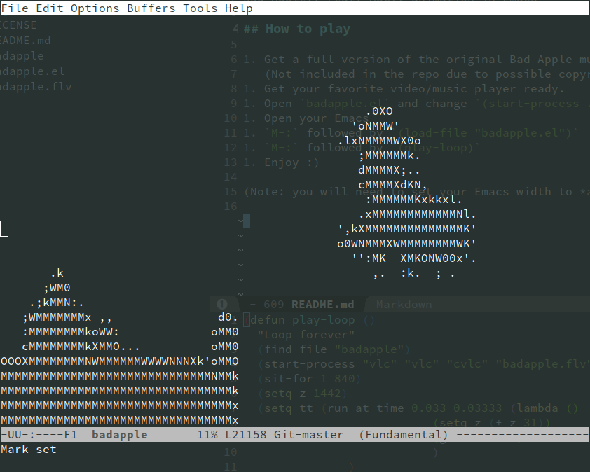
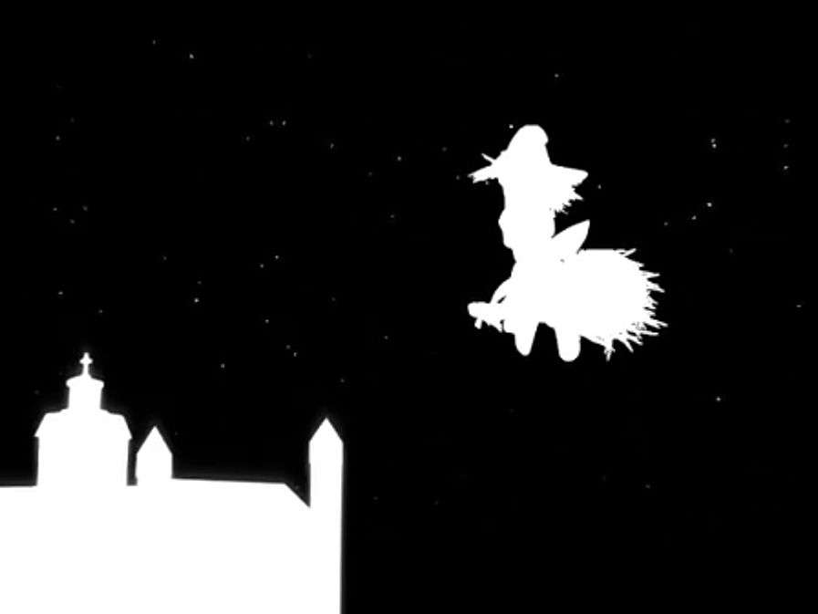

# emacs-bad-apple
Bad Apple!! Feat. ASCII animation in Emacs

## How to play

1. Get a full version of the original Bad Apple music/video file.
   (Not included in the repo due to possible copyright violation)
1. Get your favorite video/music player ready.
1. Open `badapple.el` and change `(start-process ...)` line to match your player and video/audio file.
1. Open your Emacs
1. `M-:` followed by `(load-file "badapple.el")`
1. `M-:` followed by `(play-loop)`
1. Enjoy :)

(Note: you will need to set your Emacs width to *at least* 84 chars and height to *exactly* 32 chars to fit the size of each frame)

